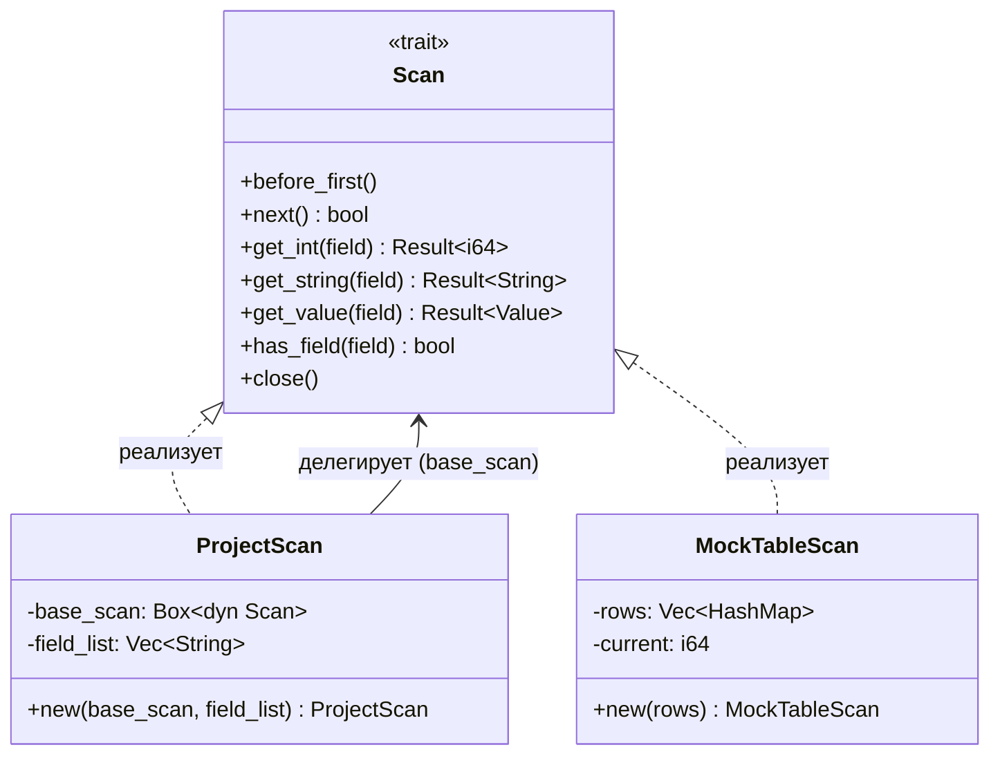

# ProjectScan — оператор проекции для учебной СУБД

## Описание

**ProjectScan** — компонент учебной СУБД, реализующий оператор **проекции** (projection) в конвейере выполнения запросов. Он оборачивает нижележащий оператор сканирования и при итерации возвращает только указанное подмножество полей (столбцов) из каждой записи.

Аналог в SQL: `SELECT col1, col2 FROM ...` — без фильтрации строк, только выбор столбцов.

Данный компонент — часть цельной СУБД, собираемой преподавателем из работ разных студентов в рамках дисциплины «Системы управления базами данных на основе суперкомпьютерных технологий».

---

## Теоретическая справка

### Проекция в реляционной алгебре

**Проекция** (π) — одна из базовых операций реляционной алгебры. Она принимает отношение (таблицу) и множество атрибутов (столбцов), возвращая новое отношение, содержащее только указанные атрибуты.

Формально: π_{A1, A2, ..., An}(R) — проекция отношения R на атрибуты A1...An.

В SQL это соответствует перечислению столбцов в `SELECT`:
```sql
SELECT имя, группа FROM студенты
-- Эквивалент: π_{имя, группа}(студенты)
```

### Volcano / Iterator model

В современных СУБД выполнение запроса строится как **дерево операторов** (query plan tree). Каждый оператор реализует один и тот же интерфейс — «итератор»:

1. **open()** / **before_first()** — инициализация, сброс к началу
2. **next()** — переход к следующей записи (возвращает true/false)
3. **get(field)** — получение значения поля текущей записи
4. **close()** — освобождение ресурсов

Это так называемая **Volcano model** (или Iterator model), предложенная Готц Грефе (Goetz Graefe). Её преимущества:

- **Композиция**: операторы можно комбинировать в произвольные деревья
- **Потоковая обработка**: записи обрабатываются по одной, без материализации промежуточных результатов
- **Модульность**: каждый оператор реализуется независимо

### Как ProjectScan вписывается в конвейер

```
        ProjectScan [имя, группа]
              │
              ▼
         SelectScan (WHERE ...)     ← (реализуется другим студентом)
              │
              ▼
         TableScan (таблица)        ← (реализуется другим студентом)
              │
              ▼
         Файлы на диске
```

ProjectScan находится «выше» в дереве: он получает записи от нижележащего оператора и «обрезает» их, оставляя только нужные поля.

---

## Архитектура

### Трейт `Scan`

Общий интерфейс для всех операторов сканирования:

```rust
pub trait Scan {
    fn before_first(&mut self);              // сброс итератора
    fn next(&mut self) -> bool;              // переход к следующей записи
    fn get_int(&self, field: &str) -> Result<i64>;     // получить целое число
    fn get_string(&self, field: &str) -> Result<String>; // получить строку
    fn get_value(&self, field: &str) -> Result<Value>;   // универсальный геттер
    fn has_field(&self, field: &str) -> bool;  // есть ли поле?
    fn close(&mut self);                       // освобождение ресурсов
}
```

### Структура `ProjectScan`

```rust
pub struct ProjectScan {
    base_scan: Box<dyn Scan>,   // нижележащий оператор
    field_list: Vec<String>,    // список проецируемых полей
}
```

- Методы навигации (`before_first`, `next`, `close`) — делегируют в `base_scan`
- Методы чтения (`get_int`, `get_string`, `get_value`) — проверяют, что поле в `field_list`, затем делегируют
- `has_field` — возвращает `true` только для полей из `field_list`

### Диаграмма взаимодействия



---

## Пояснения к коду для начинающего Rust-разработчика

### Что такое трейт и зачем `Box<dyn Scan>`

**Трейт** (trait) — это аналог интерфейса в Java или абстрактного класса в C++. Он определяет набор методов, которые должна реализовать структура. В нашем случае трейт `Scan` определяет общий интерфейс для всех операторов:

```rust
pub trait Scan {
    fn next(&mut self) -> bool;
    // ...
}
```

**`Box<dyn Scan>`** — это «трейт-объект». Разберём по частям:
- `dyn Scan` — «динамический Scan», т.е. конкретный тип неизвестен на этапе компиляции
- `Box<...>` — умный указатель, размещающий данные в куче (heap)

Зачем это нужно? `ProjectScan` должен хранить внутри себя *любой* оператор, реализующий `Scan` — это может быть `MockTableScan`, `TableScan`, или даже другой `ProjectScan`. Без `Box<dyn Scan>` компилятор не знал бы размер поля `base_scan`, потому что разные реализации `Scan` имеют разный размер.

### Ownership и borrowing: `&str` vs `String`

В Rust каждое значение имеет **владельца** (owner). Когда владелец выходит из области видимости, значение уничтожается.

- **`String`** — строка, которой владеет переменная. Может быть изменена, живёт в куче.
- **`&str`** — *ссылка* (заимствование) на строку. Не владеет данными, не может их изменить.

В параметрах методов мы используем `&str`, потому что нам не нужно владеть именем поля — достаточно заглянуть в него:

```rust
fn get_int(&self, field_name: &str) -> Result<i64>;
//                              ^^^^ заимствование — не копируем строку
```

В `field_list` мы храним `Vec<String>`, потому что `ProjectScan` должен *владеть* списком полей:

```rust
field_list: Vec<String>,  // владеем строками
```

### `Result<T, E>` и оператор `?`

Rust не использует исключения (exceptions). Вместо этого функции, которые могут завершиться ошибкой, возвращают `Result<T, E>`:

- `Ok(value)` — успех, содержит результат
- `Err(error)` — ошибка, содержит описание

Оператор `?` — сокращение для «если ошибка — вернуть её вызывающему»:

```rust
fn get_int(&self, field_name: &str) -> Result<i64> {
    self.check_field(field_name)?;  // если check_field вернул Err — выходим
    self.base_scan.get_int(field_name)  // иначе продолжаем
}
```

Без `?` пришлось бы писать:

```rust
match self.check_field(field_name) {
    Ok(()) => {},
    Err(e) => return Err(e),
}
```

### `thiserror` для определения ошибок

Крейт `thiserror` упрощает создание типов ошибок. Вместо ручной реализации трейтов `Display` и `Error` достаточно:

```rust
#[derive(Debug, Error)]
pub enum DbError {
    #[error("Поле не найдено: {0}")]
    FieldNotFound(String),
    // ...
}
```

Макрос `#[error("...")]` автоматически генерирует реализацию `Display`, а `#[derive(Error)]` — реализацию `std::error::Error`.

### Как работают тесты в Rust

Тесты в Rust — это обычные функции с атрибутом `#[test]`:

```rust
#[test]
fn test_something() {
    assert_eq!(2 + 2, 4);
}
```

- **Юнит-тесты** живут в модуле `#[cfg(test)]` внутри файла с кодом
- **Интеграционные тесты** живут в директории `tests/` и тестируют крейт как «чёрный ящик»
- Запуск: `cargo test`

В нашем проекте тесты находятся в `tests/project_scan_tests.rs` — это интеграционные тесты, которые используют публичный API крейта.

---

## Как собрать и запустить

### Сборка

```bash
cargo build
```

### Запуск тестов

```bash
cargo test
```

Ожидаемый результат: все 10 тестов проходят успешно.

### Запуск примера

```bash
cargo run --example demo
```

Ожидаемый вывод:

```
=== Результат проекции: SELECT имя, группа FROM студенты ===
Имя             Группа
-------------------------
Алиса           ИВТ-21
Борис           ИВТ-22
Вера            ИВТ-21
Григорий        ИВТ-22

Поле 'возраст' доступно? false
Поле 'имя' доступно? true
```

### Проверка линтером

```bash
cargo clippy
```

---

## API-документация

### `Value` (перечисление)

| Вариант | Описание |
|---------|----------|
| `Value::Int(i64)` | Целочисленное значение |
| `Value::Str(String)` | Строковое значение |

### `DbError` (перечисление ошибок)

| Вариант | Описание |
|---------|----------|
| `FieldNotFound(String)` | Поле не найдено в операторе |
| `TypeMismatch { field, expected, got }` | Несоответствие типов |
| `IoError(std::io::Error)` | Ошибка ввода-вывода |
| `Other(String)` | Прочие ошибки |

### `Scan` (трейт)

| Метод | Описание |
|-------|----------|
| `before_first(&mut self)` | Сброс итератора к началу |
| `next(&mut self) -> bool` | Переход к следующей записи |
| `get_int(&self, field: &str) -> Result<i64>` | Получить целое число |
| `get_string(&self, field: &str) -> Result<String>` | Получить строку |
| `get_value(&self, field: &str) -> Result<Value>` | Получить значение |
| `has_field(&self, field: &str) -> bool` | Проверить наличие поля |
| `close(&mut self)` | Освободить ресурсы |

### `ProjectScan`

| Метод | Описание |
|-------|----------|
| `new(base_scan: Box<dyn Scan>, field_list: Vec<String>) -> Self` | Конструктор |
| Реализует трейт `Scan` | Все методы трейта с фильтрацией по `field_list` |

### `MockTableScan`

| Метод | Описание |
|-------|----------|
| `new(rows: Vec<HashMap<String, Value>>) -> Self` | Конструктор из данных в памяти |
| Реализует трейт `Scan` | Все методы трейта |

---

## Возможные расширения

Данный компонент спроектирован для интеграции с другими операторами СУБД:

- **TableScan** — чтение данных из файлов на диске. Реализует тот же трейт `Scan`, поэтому может быть подставлен вместо `MockTableScan`.
- **SelectScan** — оператор фильтрации (WHERE). Оборачивает нижележащий `Scan` и пропускает только записи, удовлетворяющие предикату.
- **ProductScan** — декартово произведение двух таблиц (для JOIN).
- **SortScan** — сортировка записей (ORDER BY).

Все эти операторы реализуют трейт `Scan` и могут быть скомбинированы в произвольное дерево выполнения запроса:

```
ProjectScan [имя, группа]
     │
SelectScan (WHERE возраст > 20)
     │
ProductScan
   /     \
TableScan  TableScan
(студенты) (курсы)
```

---

## Структура проекта

```
project-scan/
├── Cargo.toml                    # манифест проекта (зависимости, метаданные)
├── README.md                     # этот файл
├── src/
│   ├── lib.rs                    # корень крейта, реэкспорт модулей
│   ├── error.rs                  # перечисление DbError и тип Result
│   ├── value.rs                  # перечисление Value (Int, Str)
│   ├── scan.rs                   # трейт Scan (общий интерфейс)
│   ├── project_scan.rs           # структура ProjectScan (оператор проекции)
│   └── mock_scan.rs              # MockTableScan (мок для тестов)
├── tests/
│   └── project_scan_tests.rs     # интеграционные тесты (10 тестов)
└── examples/
    └── demo.rs                   # пример использования
```
