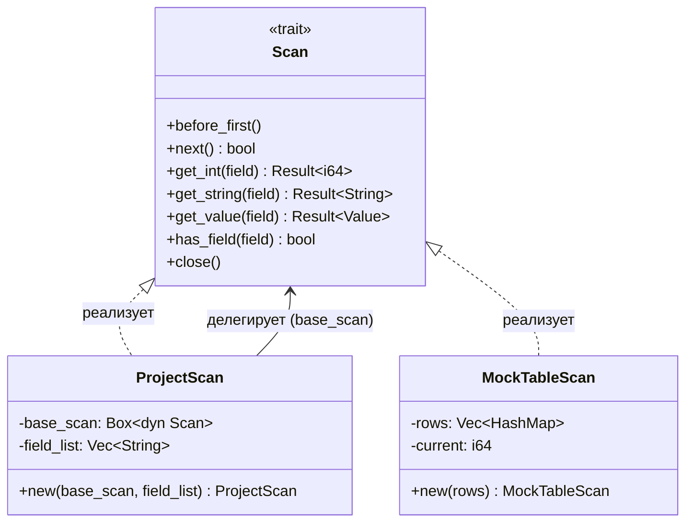

# ProjectScan — оператор проекции для учебной СУБД

Реализует выбор столбцов (`SELECT col1, col2 FROM ...`) в конвейере выполнения запросов.
Часть цельной СУБД, собираемой из компонентов разных студентов.

---

## Место в конвейере

```
ProjectScan [имя, группа]          ← этот компонент
        │
   SelectScan (WHERE ...)
        │
   TableScan (таблица)
        │
   Файлы на диске
```

---

## Диаграмма взаимодействия



---

## Трейт `Scan` — общий интерфейс

Все операторы должны реализовывать этот трейт (Volcano / Iterator model):

```rust
pub trait Scan {
    fn before_first(&mut self);
    fn next(&mut self) -> bool;
    fn get_int(&self, field: &str) -> Result<i64>;
    fn get_string(&self, field: &str) -> Result<String>;
    fn get_value(&self, field: &str) -> Result<Value>;
    fn has_field(&self, field: &str) -> bool;
    fn close(&mut self);
}
```

---

## Интеграция

`ProjectScan` принимает любой `Box<dyn Scan>` в качестве нижележащего оператора.
Чтобы подключить реальный `TableScan` вместо мока:

```rust
// Сейчас (мок):
let scan = ProjectScan::new(Box::new(MockTableScan::new(rows)), fields);

// После интеграции с TableScan:
let scan = ProjectScan::new(Box::new(TableScan::new(...)), fields);
```

`MockTableScan` можно полностью убрать — он нужен только для тестов.

---

## Публичные типы

| Тип | Описание |
|-----|----------|
| `trait Scan` | Общий интерфейс для всех операторов |
| `ProjectScan` | Оператор проекции |
| `MockTableScan` | Заглушка для тестов (заменяется на TableScan) |
| `Value` | Значение поля: `Value::Int(i64)` или `Value::Str(String)` |
| `DbError` | Ошибки: `FieldNotFound`, `TypeMismatch`, `IoError`, `Other` |

---

## Сборка и тесты

```bash
cargo build
cargo test          # 10 тестов
cargo run --example demo
```

---

## Структура проекта

```
project-scan/
├── Cargo.toml
├── src/
│   ├── lib.rs             # реэкспорт модулей
│   ├── error.rs           # DbError
│   ├── value.rs           # Value
│   ├── scan.rs            # трейт Scan
│   ├── project_scan.rs    # ProjectScan
│   └── mock_scan.rs       # MockTableScan
├── tests/
│   └── project_scan_tests.rs
└── examples/
    └── demo.rs
```
